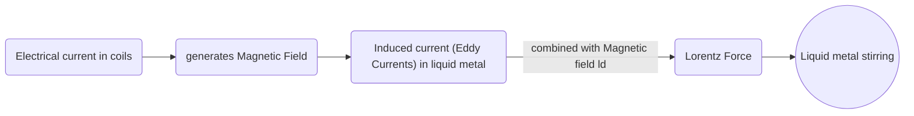

{::options parse_block_html="true" /}

## Project Description
{: .alert .alert-info}

Advisor: Prof. Pramod Kumar & Jayasankar Variyar  
Institute: [Indian Institute of Science, Bangalore, India](http://www.mecheng.iisc.ernet.in/~pradip/laboratories/nfssf/nfssf.html)   
Duration: January 2014 - June 2016    
Course: BS Thesis Research  

## Introduction
{: .alert .alert-info}

In metal casting, metal solidification starts with the formation of small crystals around an inhomogeneity (*mold, wall or impurities*) known as `nucleation sites`. Due to numerous nucleation sites, these solid crystals grow with time in different directions resulting in serval fragmented metal crystals known as **dendrites** (*directional solidification*)[^2] (*see animation below*).

The solidification pattern is crucial because the resulting mechanical properties of the casting (tensile strength, ductility etc) are affected by this. Equiaxed solid crystal (like a single dendrite) improves surface quality and reduces defects. These dendritic fragments can be broken by stirring metals. Conventionally this is done mechanically using impellers or agitators, which is not suitable for continuous casting operations and makes it prone to erosion.

[^2]: Animation from http://www.tms.org/pubs/journals/JOM/0201/Thevoz/Thevoz-0201.html

{: .imside2}

**Electromagnetic stirring is a non-contact stirring method**. It consists of circular coils placed around a vessel containing *electrically conducting metal* (Eg: continuous caster or a ladle containing molten Steel) as shown below.

## Highlights
{: .alert .alert-info}

* ANSYS FLUENT *by default* solves only CFD equations. I

## Publications
{: .alert .alert-info}

1. BS Thesis: [Modeling of Electromagnetic Stirring of Liquid Metals](https://github.com/yashg1/yashg1.github.io/blob/43c78338d9abaad9278c5321e61bdf1b698ba4e0/resources/cfd_emag_ref/GanatraYash_BSME_thesis.pdf)

## Skills
{: .alert .alert-info}

* CFD

* UDF
{: .alert .alert-success}
